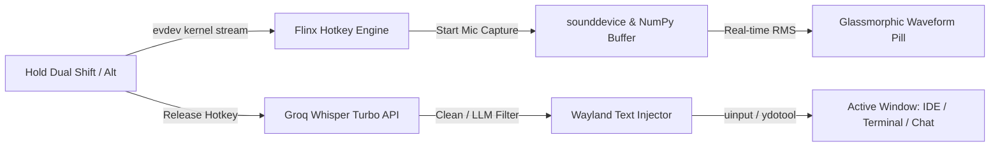

# Flinx 🎙️⚡

<p align="center">
  
</p>

<p align="center">
  <strong>High-performance push-to-talk voice dictation with a real-time glassmorphic waveform pill for Linux & Wayland.</strong>
</p>

<p align="center">
  <a href="LICENSE"></a>
  <a href="https://www.python.org/"></a>
  <a href="https://wayland.freedesktop.org/"></a>
  <a href="https://groq.com/"></a>
  <a href="#"></a>
</p>

---

## ⚡ The Story & Engineering Challenge

Modern tools like *Wispr Flow* and *Superwhisper* made fast voice-to-text dictation an indispensable superpower on macOS and Windows. However, switching to Linux on Wayland revealed a massive ecosystem void: **virtually none of these tools existed or worked natively on Wayland**.

### Why Voice Dictation is Hard on Wayland
1. **Strict Input Isolation:** Unlike X11, Wayland's security architecture intentionally prevents background applications from intercepting global keystrokes or snooping on keystrokes in other windows.
2. **Focus-Stealing Windows:** Displaying a visual HUD or floating recording pill often causes compositors (like KWin or Mutter) to de-focus the currently active editor, breaking instant text injection.
3. **Synthetic Input Protocols:** Different compositors implement divergent text injection protocols (`zwp_virtual_keyboard_v1`, `zwp_text_input_v3`, or kernel `/dev/uinput`).

### How Flinx Solves This
Flinx (**F**ahad + **Fl**ow + L**inux**) bypasses these barriers through a layered Linux-native architecture:
- **Passive Kernel Input:** Reads raw kernel keyboard events via `evdev` without grabbing exclusive device locks—enabling instant dual-key combos (like `Left Shift + Right Shift`) without interfering with regular typing.
- **Sub-400ms Transcription:** Streams 16kHz mono audio directly to Groq's LPU-accelerated **Whisper Large v3 Turbo** API.
- **Universal Wayland Text Injection:** Uses kernel-level `/dev/uinput` simulation via `ydotool` paired with Wayland clipboards (`wl-copy`), with automatic fallback for `wtype` on wlroots compositors.
- **Non-Activating Translucent HUD:** A glassmorphic PyQt6 pill with dynamic 5-bar RMS audio waveform and click-through transparency (`WA_ShowWithoutActivating` and `WindowTransparentForInput`) that never steals focus from your IDE, browser, or terminal.



---

## ✨ Features

- 🎙️ **Push-to-Talk Dictation:** Hold your trigger keys, speak naturally, and release. Your transcription is instantly typed into whatever window you were working in.
- ⚡ **Dual-Shift Preset:** Natural ergonomics. Press both `Left Shift + Right Shift` together to record—no awkward modifier gymnastics.
- 🎛️ **Obsidian Control Center GUI:** macOS/Linear-inspired dark settings dashboard (`flinx --settings`) with live mic testing, Groq API key latency validator, and 1-click Polkit permission assistance.
- 🌊 **Real-Time Liquid Waveform:** Glassmorphic floating pill with a dynamic gradient visualizer (`#F43F5E` coral to `#8B5CF6` violet) that bounces smoothly with your voice amplitude.
- 🧠 **Optional AI Post-Processing:** Built-in integration with `llama-3.1-8b-instant` to automatically strip verbal fillers (*"um", "uh", "like"*) and perfect punctuation before pasting.
- 🖥️ **System Tray Companion:** Monitor daemon health, inspect last transcribed text, launch Control Center, edit configuration, and live-reload keybindings on the fly without restarting.
- 🔊 **Synthesized Acoustic Clicks:** Auto-generated decaying sine waves provide subtle audio feedback on record start and stop—no external audio files required.
- 📦 **Standalone Packaging:** Single portable binary or AppImage build script (`scripts/build_standalone.sh`) with zero external Python configuration required.
- 🐧 **Multi-Distro Installer:** Out-of-the-box support for **Fedora**, **Arch Linux**, **Debian/Ubuntu**, and **openSUSE**.

---

## 🏎️ Latency & Performance

| Transcription Engine | Model Size | Avg. Latency | Accuracy |
|---|---|---|---|
| **Flinx (Groq Whisper Turbo)** | **Large v3 Turbo** | **~350 ms** | **State of the Art** |
| Local whisper.cpp (CPU) | Small / Medium | ~1,800 ms | Good |
| Standard Cloud APIs | Base / Small | ~1,200 ms | Moderate |

---

## 🚀 Quick Install

### 1. Clone & Run Setup
```bash
git clone https://github.com/fahadarshad/flinx.git ~/flinx
cd ~/flinx
bash install.sh
```
*You can pass your Groq API key directly: `bash install.sh --api-key gsk_xxxx`.*

> [!TIP]
> **First-Run Onboarding:**
> If you launch `flinx` without an API key, the **Obsidian Control Center** automatically opens on your screen with a link to get a free Groq key and an instant latency ping validator!

> [!IMPORTANT]
> **Wayland Input Permissions:**
> To allow reading global keyboard events without `sudo`, your user is added to the `input` group. If you encounter permission warnings, click the **"Fix Input Permissions"** button in the Control Center (System Check tab) to authorize via Polkit without opening a terminal!

---

## 🎮 Usage & Commands

Once installed, Flinx is accessible via the `flinx` command anywhere in your terminal or from your desktop application launcher:

| Command | Action |
|---|---|
| `flinx --settings` / `flinx --gui` | Open the Obsidian Control Center settings GUI |
| `flinx --check` | Verify system dependencies, kernel group permissions, and daemon status |
| `flinx --test` | Record 5 seconds of audio, transcribe via Groq, and print to stdout (no paste) |
| `flinx --test-paste` | Test text injection by typing into your active window after a 3-second delay |
| `flinx` | Run the Flinx daemon with floating pill and system tray companion |

### Autostart on Boot (Systemd)
To have Flinx start automatically whenever you log into your desktop:
```bash
systemctl --user enable --now flinx
```
To check service logs:
```bash
journalctl --user -u flinx -f
```

---

## 📦 Standalone Binary & AppImage Build

To package Flinx into a standalone, portable binary bundle that includes Python, PyQt6, PortAudio, and all dependencies:
```bash
bash scripts/build_standalone.sh
```
The compiled executable will be located in `dist/flinx/flinx`.

---

## ⚙️ Configuration

Configuration is stored in `~/.config/flinx/.env`. You can edit it directly or click **⚙️ Edit Configuration** in the system tray menu:

```env
# Required: Your Groq API key (free at https://console.groq.com)
GROQ_API_KEY=gsk_xxxx

# Push-to-talk trigger keys (evdev key names)
# Dual-shift combo (hold Left Shift + Right Shift together):
HOTKEY=KEY_LEFTSHIFT+KEY_RIGHTSHIFT

# Alternative single-key options:
# HOTKEY=KEY_RIGHTALT
# HOTKEY=KEY_RIGHTCTRL

# Floating glassmorphic pill overlay (true/false)
SHOW_PILL=true

# Whisper language hint (e.g. en, ar, fr, de, es — empty for auto-detect)
LANGUAGE=en

# Optional AI cleaner: strips filler words ('um', 'uh') & formats punctuation
LLM_CLEAN=false
LLM_MODEL=llama-3.1-8b-instant

# Subtle acoustic audio feedback on start/stop
SOUND_FEEDBACK=true

# Ignore accidental clicks shorter than this duration (seconds)
MIN_RECORDING_DURATION=0.3
```

---

## 🔧 Troubleshooting

### "Permission denied" on `/dev/input/event*`
Ensure your user belongs to the `input` group:
```bash
groups | grep input
```
If not shown, add your user and log out:
```bash
sudo usermod -aG input $USER
```

### "ydotoold is not running"
Flinx injects keystrokes via `ydotool`. Ensure its user daemon is active:
```bash
systemctl --user enable --now ydotoold
```

### Text is copied to clipboard but not pasting
1. Run `flinx --check` to confirm permissions.
2. Check that your active application supports standard Wayland clipboard paste (`Ctrl+V`).
3. For custom key delay or focus settling, adjust `MIN_RECORDING_DURATION` in `.env`.

---

## 🗑️ Uninstallation

To cleanly remove Flinx, its user services, launchers, and desktop entries:
```bash
cd ~/flinx  # or your clone directory
bash uninstall.sh
```

---

## 📄 License

Distributed under the **MIT License**. See [`LICENSE`](LICENSE) for details.

Developed with precision for Linux and Wayland desktop enthusiasts.
